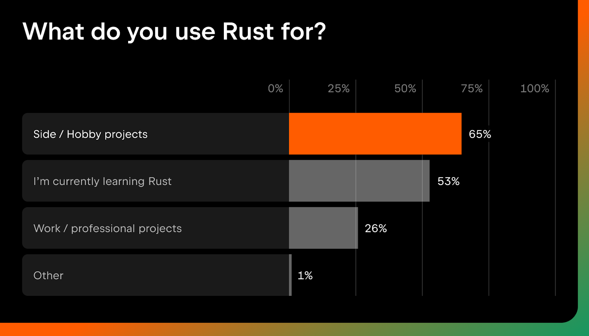
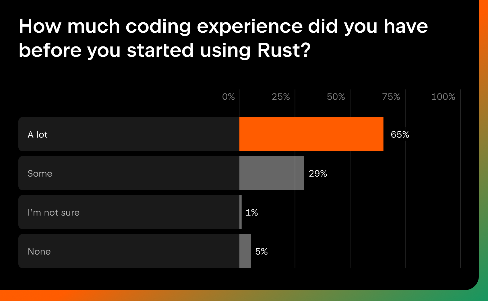

# Learner guide for Rust
### Neshesh Rai

---
## Motivation: Why learn it?

Rust is a fairly new language, being created in 2015. This is in comparison to languages like C++, which has been around in some form since 1985.
From Wikipedia[[1]](https://en.wikipedia.org/wiki/Rust_(programming_language)/ "[1]"), "It is noted for its emphasis on performance, type safety, concurrency, and memory safety."

These features make it suitable for a very wide variety of cases, but in general when you want your program to be fast but safe, Rust is a great language to reach for.

At the time of writing, Rust is the 16th most commonly used language[[2]](https://www.tiobe.com/tiobe-index/ "[2]") (climbing from 18th last year). Also interestingly, Rust users tend to:
a.) Use it mostly for side/hobby projects
b.) Not use it as their first language, rather most people learn it after having considerable programming experience already.

This shows Rust is a powerful tool that can be used in complex scenarios by programmers who are a little more familiar with programming paradigms and structures. Those who know how to use Rust can use it to great effect, often being many times faster than what it might have been in another language. One example I can think of is Oxide, a modification to the popular videogame Minecraft.
By rewriting some of the main rendering engine, a 16 year old[[3]](https://www.reddit.com/r/tauri/comments/1suttqs/im_16_and_i_just_published_oxidemc_a/ "[3]") dev managed to reduce the RAM footprint 10-50x.

However, this does not mean to stay away from Rust if you are unexperienced! There are plenty of possible stages that you could go through in order to potentially use Rust as your first language.

So to recap, Rust is useful for streamlined and quick code with good safety. It is reasonably popular, so has quite a good amount of support and is becoming more and more widespread.. If any of these traits sound useful to you then you should continue on! (You should still continue anyway...)

---

## Background: What do you need to know before starting?

I will break this section up into different "levels", where each user might need different prerequisites to get a good grasp of Rust.

### I'm too young to code! (0 experience)
To really understand Rust, a decent foundation and understanding of general progrmaming principle and computing ideas is essential.

Despite what I mentioned earlier, if you have absolutely 0 experience in programming Rust will likely have too many concepts to jump right in. In an ideal world you may have the option to study programming formally, e.g. via school or college. Many people may not be fortunate to have access to this kind of resource though. Self teaching is definitely viable, and for learning the basic ideas behind programming and logical thinking, I find brilliant.net does a decent job at teaching you fundamental ideas. Similarly, brilliant can require a subscription. Youtube can go a long way now for free, with plenty of beginner courses.

One I might reccommend:
(https://www.youtube.com/watch?v=mDKM-JtUhhc)

Python is a great language to start with, since it is much closer to natural language (english speech like patterns) and much more flexible with how you might do certain things (whereas rust might keep you confined to certain patterns).

If you are bent on starting with Rust however, you can try [this tutorial](https://www.youtube.com/watch?v=rQ_J9WH6CGk).

### Not My First Script (Beginner-intermediate)
Assuming you might have some grasp of programming principles and a language already under your belt, a great place to start is [W3Schools](https://www.w3schools.com/rust/). It has a decently friendly interface, exercises and examples that are quite useful to read and practice with. The scope of some of the information is not quite as in depth as it might need to be. A good secondary resource to then fall back on is [Rust By Example](https://doc.rust-lang.org/rust-by-example/) which helps to contextualise what a certain function might do for example. Personally, I much preferred to just read the examples and put together what I need from that information. Everyone learns differently!

At any state some relevant youtube tutorials can be found.

No Boilerplate is one of my favourite channels for bite-sized and fast paced video topics that can give you more of an overview of traits a language or topic might have. [Here is one on Rust](https://www.youtube.com/watch?v=br3GIIQeefY&t=83s).

Also at this stage, "The Book" (AKA "The Rust Programming Language") is sort of the definitive Bible of Rust, covering everything you might need to know. Technically it covers everything from thte ground up, however I refrained from mentioning it in the 0 experience section since that might still be overwhelming to a new user.

Another great resource is the Rust documentation, which is some of the best I have seen. Clear and conscise, well organised and reasonably well maintained. Any specfic inquires can be helped a lot by checking official documentation. 

This includes the level I am at. For my own project I used these sources, as well as a [Tutorial](https://www.youtube.com/watch?v=64R57pUxaA0) for ratatui that showed me some methods to create a TUI (terminal UI) although I did not end up using it.

### I eat Rust for Breakfast (advanced)

A user with experience with command tools, a good grasp of the theory behind the methodology of Rust and familiarity with a language like C++ will have little trouble adapting to Rust. One hallmark of Rust is that it is very intentional, meaning good design descisions come easily while using it. You will find yourself naturally guided to idiomatic expressions that are optimal. In terms of resources, documentation is probably one of the best things for you alongside Rust by example, but you might find the way you use them a bit different. Instead of trying to learn the concepts from the ground up you are instead looking for the changes and the specfic ideosyncrasies that might have been introduced.

A more advanced guide to Rust can be found [here](https://www.youtube.com/results?search_query=advanced+rust+guide)

Also a [link](https://www.youtube.com/results?search_query=advanced+rust+guide) to a Computerphile video, which goes into some more depth about the "guts" of Rust's memory management.

For all users however an **installation guide** might be helpful.

Rust provides their own [guide](https://rust-lang.org/tools/install/
) and CLI tool which works pretty flawlessly on multiple operating systems. Rust has modules and sharable packages in the form of "crates" which utilises their package manager "cargo" in order to install them. The interesting thing is that any dependencies by default are not integrated into the program, but rather installed at compile time. This can help with adaptability and continuity as all you have to do is have your cargo configured to download the correct verstion of whichever crate you need at runtime.

Hopefully these resources and pointers will help guide a user of any level to the right resources to get started on their journey towards mastering Rust.

### Evaluation

Overall, Rust is most definitely a worthwhile language to learn. It gives you a good amount of low level control once you understand the foundation of why Rust does as it does but is also abstract enough to where you are not fiddling around with pointers yourself. Even coming from Python myself - which is in a lot of ways opposite to Rust - I did not have too much trouble rewiring my thinking to adapt to Rust. Even the process of learning a language like Rust helps you by itself by pushing you to think in a different way and be aware just how you are manipulating memory.

In terms of other languages that do similar things, a lot of lessons from C++ were implemented into Rust from the get-go. While C++ has decades of support on Rust, it also has decades of technical debt. Other modern languages people consider to be contenders are Go and Zip. Go is simpler but that translates to some features being lost. Zip is great but very fresh and as such is lacking in-depth support. As of the moment there is nothing that really matches Rust.

__Closing thoughts__

I really enjoyed learning Rust, even though (maybe especially because?) every corner I turned I ran into something completely new and unexpected. The most fun part of it all is realising that the design descisions made were really thought out and intelligent. Hopefully these resources get you started on the same journey!