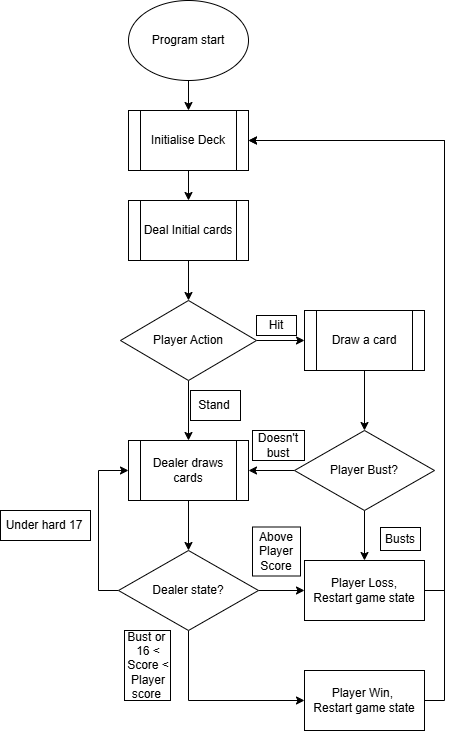

[18/02/2026]

Working with Oliver Veal and Jed Nicholson

Initial setup was simply a public repo, a private repo and a Rust file.

# Planning phase 1

- Decided to learn Rust
    - Popular modern language that's infamously fast and robust
    - I know exactly 0 Rust so this will be a good learning experience

## Initial ideas

- Calculator (GUI maybe?)
- Audio processing (fourier transform etc.)
- Minigames (in the terminal/CLI)

We settled on minigames, since this allows us to all work on the project and integrate together at the end, as well as learning different structures that we can teach each other.
The other two projects we decided would be either too little or too much for the current scope.

The games we intend to create are Snake, Connect 4 and Blackjack. We are each going to work together and learn Rust, share resources etc. After we each create our individual games, this should give us enough of a basis in Rust to come together and create a bot for Connect 4 for players to play against.

## Blackjack planning 

Rules can be read here https://en.wikipedia.org/wiki/Blackjack

### Game flow

1. Uses the 52 card deck (shuffled)
2. Player makes a bet (optional)
3. Dealer draws 2 cards
4. Player draws 2 cards
5. If player gets Blackjack they win (1.5x payout), restart game
6. Player draws, multiple options 
    (a) Player goes bust  
    (b) Player gets 21 
    (c) Player stands 
    (d) Player draws another card 
7. Dealer plays, following same rules but doesn't draw higher than 17
8. Player either has a higher (wins), lower (loses) or equal ("push", bet is returned to player) score to the dealer
9. Game Restarts

### Programmable sections

- Game flow
    - Player input
    - Game logic
    - Dealer actions
- Visual (terminal) output

-----

# Project start
Began by compiling some resources, W3 Schools with a decent intro tutorial to get to grips with syntax and program flow, and looked around online for a decent CLI UI interface. One of my collaborators mentioned crossterm?

[11/03/26]

I started my Rust project using Cargo and Crates, but quickly found that Crates was deprecated and moved on to Dependi.

Also had to manually install some MSVC build tools.

Getting used to the stricter typing and how Rust formats module imports, as well as finding the modules that did what I needed, namely randomisation and inputs.

Someone made a module that allows you to use input!() like python's input(), instead of going through the std interface which I promptly installed.

Generating the initial deck was easy(ish), I was initially going to write out the whole deck by hand with suits. Then I realised in blackjack suits are irrelevant, then I realised I could write the array once for each denomination and "multiply" by 4 then randomise. However this left me then with a 2D array, since the enumeration doesn't concatenate.

Then I thought about it again and realised this was a lot of unneccessary steps instead of just writing the deck out once (a 52 card deck never changes, so generating like so is just more operations). It did however teach me some nice stuff about array and vector handling in Rust, alongside mapping and enumeration - a worthwhile early exercise. (If you look at my commit history you'll see 2 that are like 15 minutes apart after I realise I can just do it in a simpler way).

Also learned about the display {} and debug {:?} trait outputs. Might have to abuse them a little.

[25/3/26]

Working on the main logic loop, reaing up on the elseif syntax and modules (subroutines) within Rust. I don't need them yet, but I'll keep this info in the back pocket. 

A thread from the rust forums outlined a way to take an element from a vector (the deck) and remove it afterwards. Once it gets added to player/dealer hands, you can then move on to the next iteration loop. The syntax for this was very interesting. Something more interesting was the discourse on how .remove (removes element at index and shifts all elements to the left by one address) compares to .swap_remove (swaps the element at the index to the last one in the list and pops the list). As .remove is O(n) and .swap_remove is O(1), but the tradeoff is that swap_remove will change any ordering that exists. I found it interesting because it's a (marginally) lower level optimisation that I wouldn't have thought of. [forum link](https://users.rust-lang.org/t/how-to-randomly-take-out-an-element-and-delete-it-from-vec/51986/2) 

[23/4/26]

Now that I have the main ideas behind the principles of Rust, I figured out subroutines which are more C-like than I'm used to. It also does a cool thing of returning the last expression in a function without explicitly calling `return`.

I planned out the program flow in a quick [flowchart](Blackjack_Flow.png) so I could see some of the functions I might need. 

Now I almost have every component I need, I can (in functions):
- create a shuffled deck
- draw a card
- create the main loop

However the one element I am missing is comparing the different hands. For this I somehow need to parse the values of the hands. I decided to use a hashmap. This allows me to quickly convert from type to type (str -> int) that I can then use in calculations.

I wrote this function, and had to reference the hand vectors with `hand: &[&str]`, and in the iteration then use `*[card]` being the iterator, since the * dereferences by one step allowing it to just be a string.

I also realised I had to account for soft hands (Hands with an Ace that can be low or high, since that can be 1 or 11 in blackjack). This meant I had to change the output of my function from (u32) to (u32, bool) to add a boolean value to show if it is soft or not. This means if an ace is set to high, the value is soft. This means I can then display the soft or hard value (since you have both scores simultaneously with an Ace).

After that, I wanted to write the card draw function. I realised that my deck of cards was immutable, so I changed from an array to a vector.

So I now have the parser, drawing cards etc. etc.

Now all I need to do is put it all together in one big program flow, facilitated easily by my flow diagram.

TODO - fold the draw function into a concat. for the dealer hands [X]
Parse hands and write logic
Rewrite random selection logic, shuffling isn't working properly. Use shuffl crate?
